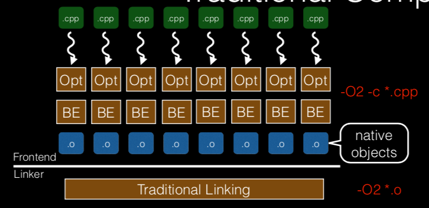

% Optimizing after the compiler: FDO and LTO
% Nicolo' Valigi
% Jun 15 2019

## Goal

Make code run faster

## Plan

- The C/C++ compilation model: compiler and linker
- Optimizing modules, not functions
- Link Time Optimization (LTO) and ThinLTO
- Feedback-Guided optimization
- Bonus: reordering binaries (BOLT)

## About me

- Sofware Engineer, mainly working on Robotics (drones, self-driving cars).
- Personal blog at [nicolovaligi.com](nicolovaligi.com).

I work on the build infrastructure and toolchain at Cruise Automation.

Will tend to talk more about Clang than gcc, since that's what we use at work. Mostly because we can use it to build code for Nvidia GPUs with the latest C++ features.

I'll try to be practical but also include information about the implementation details of the toolchain, because (a) they're really interesting, (b) when you're spending a day trying to cut the compilation time of template-heavy code, it's very useful to know what the compiler is doing with your code.

Political problems, because the gcc community thought that having a documented IR would enable the development of closed-source backends and frontends. GPL 3.0 resolved these issues, and finally GCC aquired a SSA form that could be used 

LTO

WHOPR

Minimize the serial processing time in favor of parallel.

LIPO

Combine runtime feedback and LTO. the callgraph is built during runtime.

WHOPR is the default in gcc since 4.6. The old, monolithic LTO is behind a feature flag.

# Background

## The compilation model

There are three main actors in C++ compilation: *preprocessor*, *compiler*, and *linker*. For this talk, we're
going to focus on the compiler and linker.

- what is a compiler: produces object files: parsing, code generation, optimization
- what is a linker: loads the object files and produces the final executable

## Why this compilation model is great

- **Parallel**: compilation of each Translation Unit can happen in parallel, pulling the *declarations* of
classes and functions, but not their definitions. The final link is the only serial step at the end.

- **Incremental**: modifying a `.cc` file only forces a re-compilation of a single object file and re-linking, which is much faster

## When this compilation model breaks down

- Functions can't be optimized across different translation units. Most importantly, functions in different translation units can't be **inlined**, which is one of the most effective optimization techniques.

- Lots of repeated work, especially when working with templates.

## How a compiler works

three stage pipeline with the intermediate representation

## The evolution of compilers

Actually, looking at the history of gcc is really interesting, because it organically grew to support more and more features, and to keep up with the feature bloat in C++.

- statement by statement: expression simplification, but also common subexpr elimination and peephole optimization.

If you extend the scope of optimizations to individual functions, then you can do most classical optimizations: constant propagation, common subexpr elimination, register allocation, and instruction scheduling.

## Focusing on inlining

Inlining is one of the core optimizer features that allows the **no-overhead** abstractions that we all know and love from C++.

example code with inlining - runtime drops to zero as the compiler optimizes everything out.

## When inlining breaks down

Now move the other function in a different translation unit: inlining doesn't work anymore

## Further note

I made an example with inlining because it's easily the most important optimization in compilers today. However, expanding the scope of the optimization in terms of line of code is a general win situation.

## Where to go from here

So, inlining breaks across translation units. What can we do about it?

The natural idea is to stop doing separate compilation, and generate code for the complete program instead. This is the idea behind LTO (Link Time Optimization).

Let's take the example of the LLVM toolchain: the compiler does very little work

## LTO in gcc and clang

Conventional LTO has been present in both gcc and clang since the early 2000's.

## What's wrong with conventional LTO

- **slow** because most of the optimizations are done on the complete program, where they can't be parallelized.

- **not incremental** as the whole program has to be re-optimized from scratch on every change.

- **memory hungry** because the whole program is compiled at once.

## Implementation details

- The compiler leaves the intermediate representation in the object files (LLVM IR or GIMPLE).

- The linker calls back into the optimizer through a _plugin_, so that the actual optimization work can be done.

## Where to now?

_Intuition_: compiling the whole program from scratch is overkill: most functions have a limited _action range_. This is the idea behind WHOPR (gcc) and ThinLTO (LLVM).

They're both aimed at using LTO on very large programs (e.g. Chromium).

## Some more about ThinLTO

- contents of the thin link indices
- gets rid of (some) redundant codegen operations

## Recap

With LTO, the compiler has visibility beyond a single translation unit. This brings opportunities for more extensive optimizations, most importantly inlining.

Let's go back and talk about **inlining**. Usually, the compiler has some heuristics to figure out when a certain function should be inlined (mostly by size).

However, we can actually run the code! What does that get us?

## Why does inlining make the code faster?

Secret sauce that makes C++ fast even with all the abstractions.

TODO: complete this
TODO: move?

- eliminates the overhead of the `call`/`ret` sequence
- eliminates the overhead of passing arguments and returning results
- can use the caller/callee context for optimizations

Cons

- increase compilation time
- increase code size: caches fill up faster

## Profile-guided optimization

Running the code gets us the **call graph**, a representation of all the function calls in the program during _actual operation_.

- training data needs to be a decent match to the real operation.

- implemented by google as LIPO (see paper) - since Google always wants peak performance, they do _both_ LTO and FDO. It makes sense to do both at the same time.

## The call graph

Directed multigraph where nodes are functions, and edges are calls weighted by invocation frequency.

# Thanks

IPA: Inter-Procedural analysis

TODO:
- make examples of some optimizations, and how LTO can improve them.
- run some numbers on clang?
- -fwhole-program and the importance of linker visibility.
- comparison between WHOPR and ThinLTO from the ThinLTO slides: the idea is the same (small serial + big parallel step), but the clang implementation is better.

For example, a conditional branch may turn out to be always true or always false at this particular call site. This in turn may enable dead code elimination, loop-invariant code motion, or induction variable elimination.

LIPO represents a major paradigm shift in program compilation – it makes IPO implicitly available with FDO. This new compilation model is transparent, and does not require user change their build system (if the build system already incorporates FDO, this is certainly true. This will be even more true when LIPO is incorporated with sampled FDO when no additional instrumention step is needed). It is scalable and does not lose build time parallelism.
